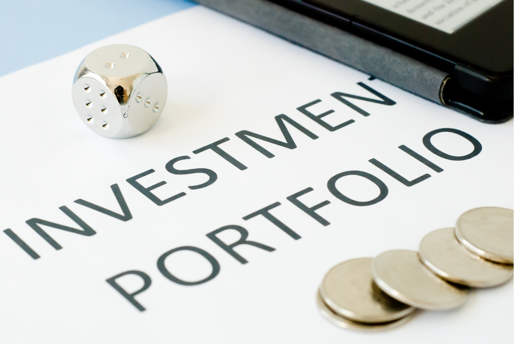

# **Calculating portfolio returns and Cumulative portfolio returns in Python**

[**What Is a Portfolio Investment?**](https://www.investopedia.com/terms/p/portfolio-investment.asp) - A portfolio investment is an asset that is purchased in the expectation that it will earn a return or grow in value, or both.

[**What Is Portfolio Return?**](https://www.investopedia.com/terms/p/portfolio-return.asp) - A portfolio return is a reference to how much an investment portfolio gains or loses in a given period of time.

We are going to calculate the portfolio returns and Cumulative portfolio returns using Python and it is explained in detail in the Jupyter Notebook

## **Things to know :**

- [**Geometric Average Return**](https://studyfinance.com/geometric-average-return/) : Popularly called Geometric Mean Return, it is primarily used for investments that are compounded. It is used to calculate average rate per period on investments that are compounded over multiple periods.

- [**Portfolio Standard Deviation**](https://www.wallstreetmojo.com/portfolio-standard-deviation/) : Portfolio Standard Deviation refers to the volatility of the portfolio which is calculated based on three important factors that include the standard deviation of each of the assets present in the total Portfolio, the respective weight of that individual asset in total portfolio and correlation between each pair of assets of the portfolio.

- [**Portfolio Sharpe Ratio**](https://www.investopedia.com/terms/s/sharperatio.asp) : The Sharpe ratio adjusts a portfolio’s past performance—or expected future performance—for the excess risk that was taken by the investor.

