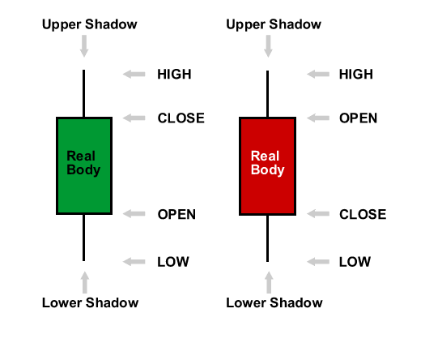
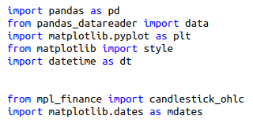
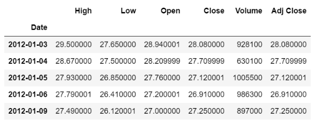
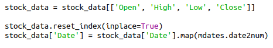
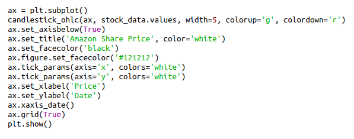
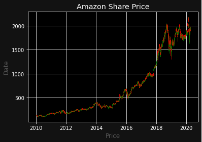

# Creating Candlestick Chart Visualisation for Stock Analysis

Charts are a technical trader's portal to the markets. With so many advances in analysis platforms, traders are able to view a tremendous assortment of market information. But with so much data available, it's important to create well-designed charts that will enhance the market analysis. 

The faster you can interpret market information, the faster you can react to the changing conditions.

There are **4** main types of charts that are used by investors and traders depending on the information that they are seeking and their individual skill levels. The chart types are: **line chart**, **bar chart**, **candlestick chart** and **point & figure chart**. 

Moving on to the main topic, what is a **CandleStick Chart**?

A candlestick chart is a very common and useful representation of stock prices. By looking into a candlestick chart, we can visually see the open, close, low and high price for any given stock.

The main component of the chart which represents prices looks like a candlestick, with a thick ‘body’ and usually a line extending above and below it, called the **upper shadow** and **lower shadow** respectively.The top of the upper shadow represents the **high price**, while the bottom of the lower shadow shows the **low price**.

For more details, refer to the youtube video : [**How to Read Japanese Candlechart?**](https://youtu.be/OGFxp3Pixg8)

We are going to build a Python script that plots a professional candlestick chart for a specific company at the stock market

For our script we will need to import a couple of libraries. Most of them are external and need to be installed.

- datetime: To define our desired time span
- matplotlib.dates: This library will convert our dates into the necessary number format
- matplotlib.pyplot: used for displaying our chart in the end
- pandas_datareader: The module that will load the desired stock data
- candlestick_ohlc from mpl_finance: Our main library for plotting

Using the pandas datareader and Yahoo Finance API, the stock data for the company Amazon for the time period of 2010-2020 has been extracted

Columns such as Volume and Adj Close are not needed for our chart. For our candlestick chart, we need the values Open, High, Low, and Close in that exact order and also Date as the x-axis. In pandas, it is quite simple to select and reorder columns in a data frame.

Select the four relevant columns in the right order and replace the current data frame. Notice that double square brackets are used here.

Now,the columns in the right order but there is still a problem ie the date doesn’t have the right format and since it is the index, it cannnot be manipulated it. Therefore, we need to reset the index and then convert the datetime to a number.

So,drop the index and map the date2num function onto the Date column. Now, the datetime values are converted into numbers that matplotlib can deal with.

Now we can define the plots and visualise the data

Define a new subplot (also called axis) for the data and use the candlestick function, in order to plot the values. Also, we define the colors and the width of the sticks and we put the dates on the x-axis and turn on the grid.

To make our chart look a bit more professional, we will make some changes in its style.

Of course, the more you zoom in, the more you will be able to see the individual candlesticks. This is a great way to visualize four different values in a single chart.
