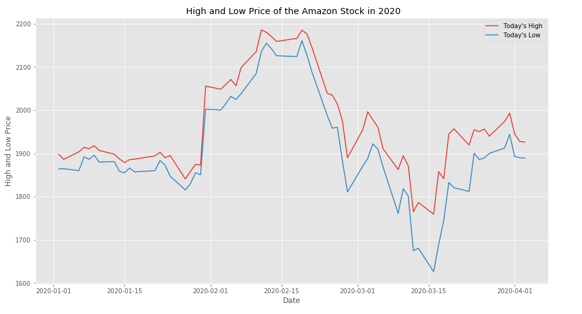

# BASICS OF STOCK DATA

Quantitative Analysts who believe in Trading need access to Stock Price and Volume so that they can compute a combination of Technical Indicators (Eg: SMA, BBP, MACD etc) for strategy. This data is available on many platforms such as IEX, Quandl via REST APIS.

**Pandas** is one of the most popular tools for trading strategy development because Pandas has a wide variety of utilities for data collection, manipulation and analysis, etc. It contains subpackage called **pandas_datareader** which provides a consistent simple API to collect data from these platforms and create a dataframe.

This dataframe consists of attributes such as Date, Opening Price, Closing Price, High Price, Low Price, Volume of the Stocks and Adjusted Closing Price.

- [**Open**](https://www.investopedia.com/terms/o/openingprice.asp) - When the stock market opens in the morning for trading, what was the price of one share?
- [**High**](https://www.investopedia.com/terms/t/todayshigh.asp) - over the course of the trading day, what was the highest value for that day?
- [**Low**](https://www.investopedia.com/terms/t/todayslow.asp) - over the course of the trading day, what was the lowest value for that day?
- [**Close**](https://www.investopedia.com/terms/c/closingprice.asp) - When the trading day was over, what was the final price?
- [**Volume**](https://www.investopedia.com/terms/v/volume.asp) - For that day, how many shares were traded?
- [**Adj Close**](https://www.investopedia.com/terms/a/adjusted_closing_price.asp) - It is considered to be the true price of that stock and is often used when examining historical returns or performing a detailed analysis of historical returns.

In this Python Script using the pandas datareader and Yahoo Finance API, the stock data for the company Amazon for the year 2020 has been extracted and various plots have been created with the data using the matplotlib's pyplot.

